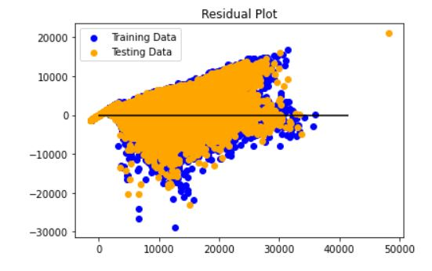

# Project_Machine_Learning
Group project: using historical data for a large European drugstore chain, we evaluated six machine learning regression models for predicting sales.

Given: regression models are commonly used for market forecasting, predicting future revenue; and, in our data set, to make predictions on an output value given a new input.

We examined Rossman, a large drug store chain with many stores across Europe, sales and stores data from a Kaggle.com competition, to predict future sales based on past data.  Of the many ways to include numerous features, we processed the data and narrowed our features to 12.  Source: https://www.kaggle.com/c/rossmann-store-sales/data

Initially, we compared the performance of four machine learning regression models we covered from Sklearn’s libraries.  Through testing, we learned that preprocessing with StandardScaler did not affect the model score in a meaningful way, regardless of the model used.  Consistent with sklearn libraries generally, we define the model object, fit the model to the data, then made predictions and evaluated the model.
- - -

* Multiple linear regression utilized the model.score method to evaluate and contrast models & residual plots where available; included for all is a sample plot for the first 25 predicted vs actual values, which visually represents the overall model score.
- - -

* Overall, model scores were very similar.  The residual plots worked for the Multiple Linear Regression and Ridge models only, due to an unresolved “memory error”.  The two residual plot distributions were not perfect in terms of symmetrical distribution and absence of clear patterns, but considered sufficient for our purposes.  Despite the persistance of an unresolved “memory error”, we were still able to make predictions and collect scores for comparisons.  The models answer our central questions: to analyze and predict sales.  The same inputs produced very similar sales predictions across four models.
- - -

* 86% of the variation in sales can be explained by the independent variables (features used) in a Linear, Lasso, Ridge, or ElasticNet regression model.
- - -

* Based on the machine learning map found on scikit-learn.org, we also looked at the performance of the SGD (stochastic gradient descent) regressor model.  Specifically, we followed the map path for predicting a quantity, with a data set containing more than 100,000 samples (we had >1,000,000 samples).  According to the documentation and class activities, StandardScaler was used to scale the dataset, and we found the model score remained relatively the same.
- - -

* Exploring different ways that other analysts’ work have utilized regression models to predict future sales, we focused on a machine learning framework originally developed by Microsoft LightGBM (Light Gradient Boosting Machine).  This model was evaluated to have the best r2 value, at 98% vs 86%, the highest accuracy of all the models tested.
* Regardless of the model utilized to make predictions, given a set of twelve featured data points we can use model.predict() to predict sales.
